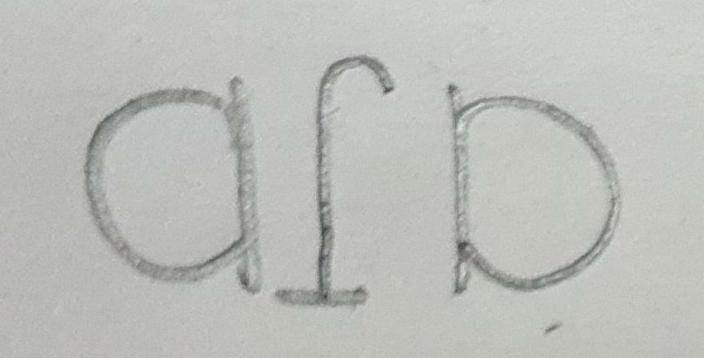
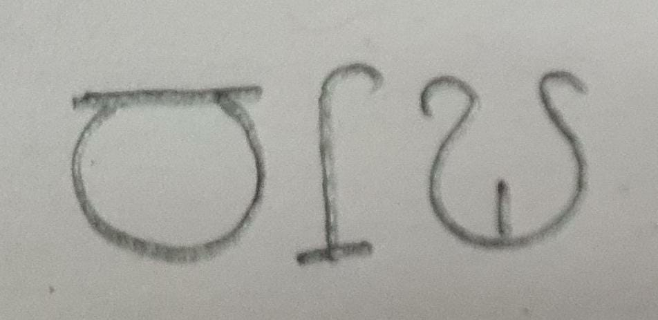
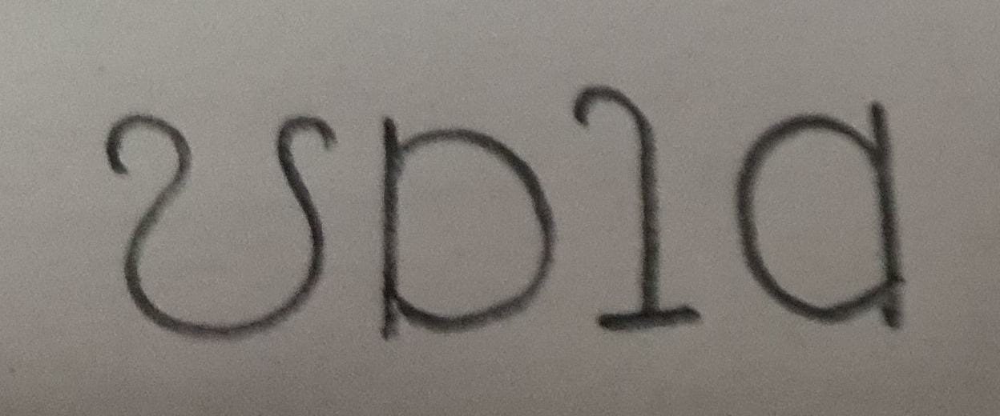

# Introduction to Linguistics - I, IIIT Hyderabad
# Assignment 2

Name: Abhinav S Menon  
Roll No.: 2020909122

## Problem Solutions

### Problem 1 – Alphabet (UKLO '16)
#### Question 1.1  
The completed table is as follows:

| Greek Name | Roman Capital Shape
| :---: | :---: |
| alpha | A |
| beta | B |
| gamma | C |
| delta | D |
| epsilon | E |
| zeta | Z |
| eta | H |
| theta | - |
| iota | I |
| kappa | K |
| lambda | L |
| mu | M |
| nu | N |
| ksi | - |
| omicron | O |
| pi | - |
| ro | P |
| sigma | S |
| tau | T |
| upsilon | Y |
| phi | - |
| chi | X |
| psi | - |
| omega | - |

#### Question 1.2  
Four Roman letters differing from their Greek ancestors are H (from eta), Y (from upsilon), X (from chi) and P (from ro).

#### Question 1.3  
The corresponding English words are _alphabet_, _atom_, _theory_ and _architect_.

### Problem 2 – Running Speech
#### Question 4.1  
The transcriptions of _would_ in utterance 6 and _bread_ in utterance 8 are [wʊd] and [bɹed] respectively.

#### Question 4.2
Three other examples of _bread_ are:  
1. [bɹed] (13)  
2. [bɹeb] (13)  
3. [bɹed] (19)  

Four other examples of _would_ are:  
1. [wʊg] (2)  
2. [wʊd̪] (3)  
3. [wʊd] (7)  
4. [wʊg] (11)  

#### Question 4.3  
The three examples of _one_ are:  
1. [wʌm] (5)  
2. [wʌn̪] (12)  
3. [wʌŋ] (14)  

#### Question 4.4  
(a) Two instances of _second_ are [sekənd] (16) and [sekəm] (20). On its own, it would be said as [sekənd].  
(b) Two instances of _mint/mints_ are [mɪŋk] (18) and [mɪns] (18). On its own, it would be said as [mɪnt].  
(c) Two instances of _can't_ are [kɑːŋk] (9) and [kɑːn̪] (15). On its own, it would be said as [kɑːnt].  
(d) Two instances of _and_ are [əm] (8) and [ənd] (18). On its own, it would be said as [ænd].  

#### Question 4.5  
(a) _bread and butter_
(b) _I wouldn't care_

### Problem 3 – Visible Speech
#### E1  
The words represent _peaks_, _boot_, _tap_ and _cogs_ in that order.

#### E2  
The words represent _back_, _piece/peace_, _dog_ and _peas_ in that order.

#### E3  
The representations of the given words are:  

  

  

\
\
\
\
\
\
\
\
\

## Observations
1. (Problem 1) In question 1.3, the English words don't have the endings of the Greek words (_-a_, _-os_ and _-on_ in transcription), so maybe these endings are variable, i.e., the words don't always end with these letters depending on context.  
2. (Problem 2) If a word ends in two consonants, and the next word starts with a consonant, the last consonant of the first word is frequently not pronounced. For example, _can't think_ becomes [kɑːn̪θɪŋk]. Further, the last remaining consonant's place of articulation changes to match that of the first consonant in the next word; for example, _one bike_ is pronounced as [wʌmbaɪk].  
3. (Problem 2) One peculiarity of the South British accent is the occurrence of [əʊ], where in Indian English [oː] occurs, and of [eɪ] where in Indian English [eː] occurs. Examples include _go_ [gəʊ] and _cake_ [keɪk].  
4. (Problem 3) The system of Visible Speech is clearly phonetic and follows a one-one sound-symbol correspondence, and so could be said to illustrate the feature of duality of patterning. It is also of note that even though it is phonetic, it is structurally different from Indian language scripts, since the vowel symbols remain distinct from the consonant ones.
